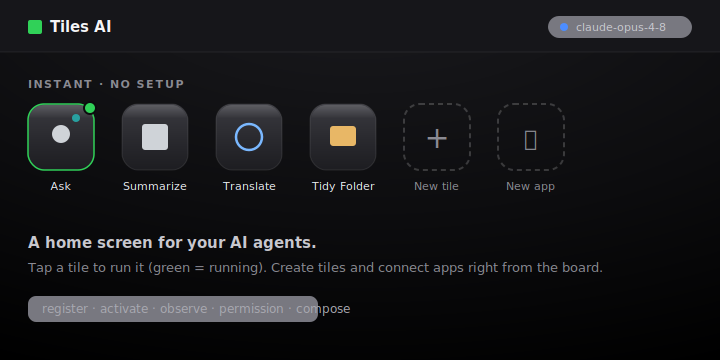

# 🟩 Tiles AI

**A home screen for your AI agents.** Lay your agents out as tiles on a board,
tap one to run it, and stay in control of anything it does.

[](https://pypi.org/project/tiles-ai/)
[](https://github.com/Manav020201/tiles-ai/actions/workflows/ci.yml)
[](LICENSE)



## What is it?

Think of your phone's home screen — but every app is an AI agent.

- A **board** is a grid of **tiles**.
- Each **tile** is one agent that does a single job — *"summarize my inbox"*,
  *"tidy this folder"*, *"draft a reply"*.
- Tap a tile and it turns **green** — running.

Tiles AI handles the parts *around* an agent — running it, watching it, asking
your permission before it acts, and connecting it to your apps. You bring the
agent's logic (plain Python, or wrap LangChain / CrewAI / the OpenAI SDK).

It's built for **developers learning to build agents**: start from a ready-made
board and add your own tiles right from the screen.

## Quick start

You'll need **Python 3.11+**. The board ships pre-built in the package:

```bash
pipx install tiles-ai      # or: pip install tiles-ai
tiles up --echo            # seeds a starter board here on first run
```

Open **http://127.0.0.1:8000** — you'll see a starter board running on a free
offline brain (no API key needed). The first run drops the starter tiles and
connectors into the current folder (so you can edit them); run `tiles init`
yourself to seed a board without starting the server. When you're ready for a
real model, run `tiles up` and connect a brain from the screen.

<details>
<summary>From source (to hack on Tiles itself)</summary>

You'll also need **Node 18+** to build the board once.

```bash
git clone https://github.com/Manav020201/tiles-ai && cd tiles-ai
pip install -e ".[dev]"
npm --prefix frontend install && npm --prefix frontend run build
tiles up --echo
```
</details>

## What you can do

**Right away — no API keys:**

- **Instant tiles** — Ask, Summarize, Translate, Extract, Brainstorm.
- **Your files** — summarize a folder, find files, or tidy a folder (it *proposes*
  the moves; you approve them).

**Add your apps** — GitHub, Slack, web search, Gmail, and anything with an
[MCP](https://modelcontextprotocol.io) server (local or remote), via an API token
or OAuth.

**All from the board — no editor required:**

| | |
|---|---|
| ➕ **Create a tile** | fill a form; Tiles writes the files for you |
| 🔌 **Connect an app** | paste its command; Tiles reads its tools automatically |
| 🧠 **Choose your model** | cloud (Anthropic / OpenAI) or local (Ollama) |
| ✅ **Approve before it acts** | anything that writes or sends waits for your OK |
| ⏱ **Schedule & chain** | run a tile on a timer, or feed one tile's output into another |
| 👀 **Observe** | live activity per tile, and clear errors as you go |

## How it works

Three ideas:

| Concept | What it is |
|---|---|
| **Tile** | an agent — a model + instructions + a permission level. The thing you tap. |
| **Connector** | a reusable connection to one app (e.g. GitHub). Many tiles can share it. |
| **Brain** | the model that powers tiles. Set one once; a tile can pin its own. |

**Permissions are built in.** Every tile has a level: **read-only** (never acts),
**draft** (proposes actions you approve), or **autonomous**. Green means
*running*, not *unsupervised*.

<details>
<summary>Architecture (for the curious)</summary>

```
React board ──HTTP/SSE──▶ FastAPI ──▶ runtime ──▶ permission gate ──▶ connector ──▶ app
                                         └──▶ model adapter ──▶ brain (cloud / local)
```

Connectors talk to apps over [MCP](https://modelcontextprotocol.io) (stdio or
HTTP). The full design is in [SPEC.md](SPEC.md).
</details>

## Make your own tile

The easy way: click **➕ New tile** on the board, fill the form, and open the
generated `handler.py` to customize.

In code, a tile is a small folder with a manifest and one method:

```python
from tiles_ai.contracts import ActionPlan, Tile

class MyTile(Tile):
    async def run(self, input, context) -> ActionPlan:
        answer = await context.model.complete(str(input))
        return ActionPlan(result=answer)
```

Full guide, including how to connect a new app: **[docs/AUTHORING.md](docs/AUTHORING.md)**.

## Troubleshooting

<details>
<summary><strong>The board is empty, or <code>http://127.0.0.1:8000</code> shows <code>404 Not Found</code></strong></summary>

You're almost certainly running a **source checkout** or an **editable install**
(`pip install -e`) instead of the published package. The board UI and the starter
tiles are built into the *wheel*; a source tree only has them after a release
build, so it serves nothing at `/` and shows no tiles.

The fix is to install the real package into an **isolated environment** so nothing
shadows it (see the next item). If you *do* want a checkout to serve the board:

```bash
npm --prefix frontend run build && cp -r frontend/dist src/tiles_ai/web
python scripts/bundle_starter.py        # adds the seedable starter board
```
</details>

<details>
<summary><strong><code>pip install tiles-ai</code> says "Requirement already satisfied" / won't update</strong></summary>

A pre-existing install — often an editable one from a clone — is registered, so
`import tiles_ai` resolves to *that*, not the download. Install into a fresh
virtual environment instead (non-destructive; leaves any dev checkout intact):

```bash
python3 -m venv ~/tiles-test-env
~/tiles-test-env/bin/pip install --upgrade pip tiles-ai
mkdir -p ~/tiles-demo && cd ~/tiles-demo
~/tiles-test-env/bin/tiles up --echo
```

Or, to use your base environment, remove the old install first:
`pip uninstall tiles-ai` then `pip install tiles-ai` (re-run
`pip install -e ".[dev]"` in your clone afterwards if you were developing).
</details>

<details>
<summary><strong><code>pipx install tiles-ai</code> fails with an <code>ensurepip</code> / venv error</strong></summary>

This is a pipx + Python toolchain problem (commonly a freshly-installed Python
whose `ensurepip` is broken), not a Tiles problem — pipx never reaches the
package. Either point pipx at a known-good Python:

```bash
PIPX_DEFAULT_PYTHON=$(which python3) pipx install tiles-ai
```

or skip pipx and use the plain `venv + pip` recipe in the item above.
</details>

<details>
<summary><strong>I added a real API key and Test passed, but tiles still just echo</strong></summary>

You're running `tiles up --echo`. The `--echo` flag forces an **offline demo
brain** — every tile (and the Test button) returns a canned echo, and real keys
are ignored by design. Restart **without** `--echo`:

```bash
tiles up
```

then add your key in **Settings (🧠)**. It's saved to `brain.local.yaml` and used
for every tile. (On recent versions, clicking Test while in `--echo` mode says so
explicitly instead of reporting a false "working".)
</details>

<details>
<summary><strong>A tile fails with "model call failed" / HTTP 529 / 502</strong></summary>

`529 Overloaded` (and `429`, `503`) are **transient errors from the model
provider**, not a Tiles bug — your key is working, the provider is just busy.
Tiles retries these automatically with backoff; if it still fails, wait a few
seconds and run the tile again. A persistent `401`/`403` instead means a bad or
unauthorized API key — re-check it in **Settings (🧠)**.
</details>

<details>
<summary><strong>I have an old version installed</strong></summary>

Check with `tiles --version` and `pip show tiles-ai`. Upgrade with
`pip install --upgrade tiles-ai` (inside the right environment — see above).
</details>

## Docs

- **[SPEC.md](SPEC.md)** — the design and the tile contract
- **[docs/AUTHORING.md](docs/AUTHORING.md)** — build a tile or a connector
- **[CONTRIBUTING.md](CONTRIBUTING.md)** — dev setup and how to help
- **[CHANGELOG.md](CHANGELOG.md)** — what's new

## Status

Active development; well-tested with CI on Python 3.11 and 3.12.

**Already here:** tiles **chain** (sequential flows), run on an **interval
schedule**, and connect via **OAuth** (authorization-code) or API keys.

**Refinements still to come:** branching / fan-out flows (only linear chains
today) · cron and event triggers (only intervals today) · automatic OAuth token
refresh. Out of scope for now: hosting and multi-user.

## License

[MIT](LICENSE).
